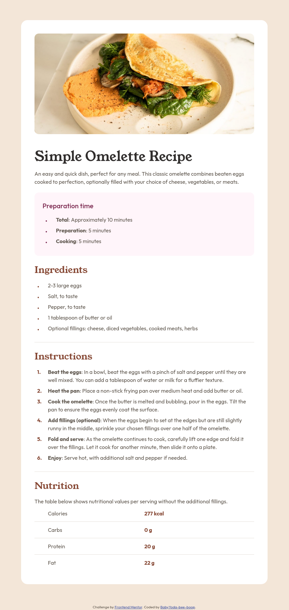
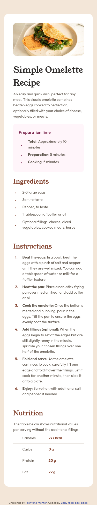

# Frontend Mentor - Recipe page solution

This is a solution to the [Recipe page challenge on Frontend Mentor](https://www.frontendmentor.io/challenges/recipe-page-KiTsR8QQKm). Frontend Mentor challenges help you improve your coding skills by building realistic projects. 

## Table of contents

- [Overview](#overview)
  - [The challenge](#the-challenge)
  - [Screenshot](#screenshot)
  - [Links](#links)
- [My process](#my-process)
  - [Built with](#built-with)
  - [What I learned](#what-i-learned)
  - [Useful resources](#useful-resources)
- [Author](#author)

## Overview

### Screenshot

  

    <h2>Desktop version:</h2>
    
  

  

    <h2>Mobile version (375px):</h2>
    
  

### Links

- Solution URL: [Click here](https://www.frontendmentor.io/solutions/scss-variables-and-mixins-YWFYpqlfh4)
- Live Site URL: [Click here](https://babyyoda-bee-boop.github.io/recipe-landing-page/)

## My process

### Built with

- Semantic HTML5 markup
- SCSS variables and mixins

### What I learned

It is possible to create custom numbered lists using CSS counters and pseudo-elements, using only CSS

### Useful resources

- [CSS Counters](https://www.w3schools.com/css/css_counters.asp) - for generating custom numbering in CSS

## Author

- Website - [BabyYoda-bee-boop](https://github.com/BabyYoda-bee-boop)
- Frontend Mentor - [@BabyYoda-bee-boop](https://www.frontendmentor.io/profile/BabyYoda-bee-boop)
